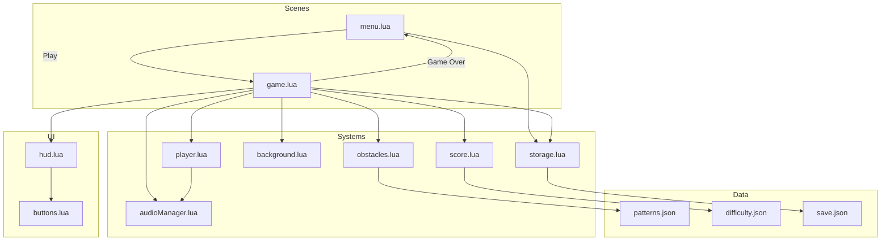

# 🧩 **Pixel Runner — Architecture Diagram**

---

---

# 🔍 **How to Read This Diagram**

### **Scenes**
- `menu.lua` and `game.lua` are the entry points.
- Flow is simple: **Menu → Game → Menu**.

### **Systems**
Each system is modular and reusable:
- **player.lua** handles movement, jumping, physics.
- **obstacles.lua** manages pooling, spawning, patterns.
- **background.lua** handles parallax scrolling.
- **score.lua** manages scoring + difficulty curves.
- **audioManager.lua** centralizes SFX/BGM.
- **storage.lua** handles persistence.

### **UI**
- HUD displays score and game state.
- Buttons module provides reusable UI components.

### **Data**
- JSON files define obstacle patterns and difficulty curves.
- Save file stores high score + settings.

---
