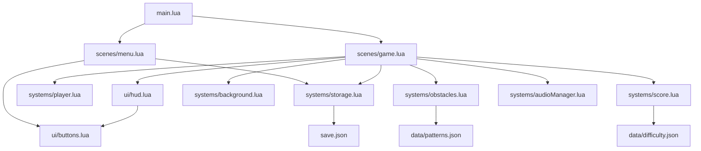

# 🧩 **Module Dependency Graph**

---

---

# 🔍 What This Diagram Shows

### **1. Entry Point**
- `main.lua` loads Composer and routes to the menu.

### **2. Scene Dependencies**
- `menu.lua` uses:
  - `buttons.lua` for UI
  - `storage.lua` to load high scores

- `game.lua` orchestrates:
  - Player system
  - Obstacle system
  - Background system
  - Score system
  - HUD
  - Audio
  - Storage

### **3. System → Data Relationships**
- Obstacle patterns come from `patterns.json`
- Difficulty curves come from `difficulty.json`
- Save data is persisted in `save.json`

### **4. UI Layer**
- HUD depends on the shared button module

---
