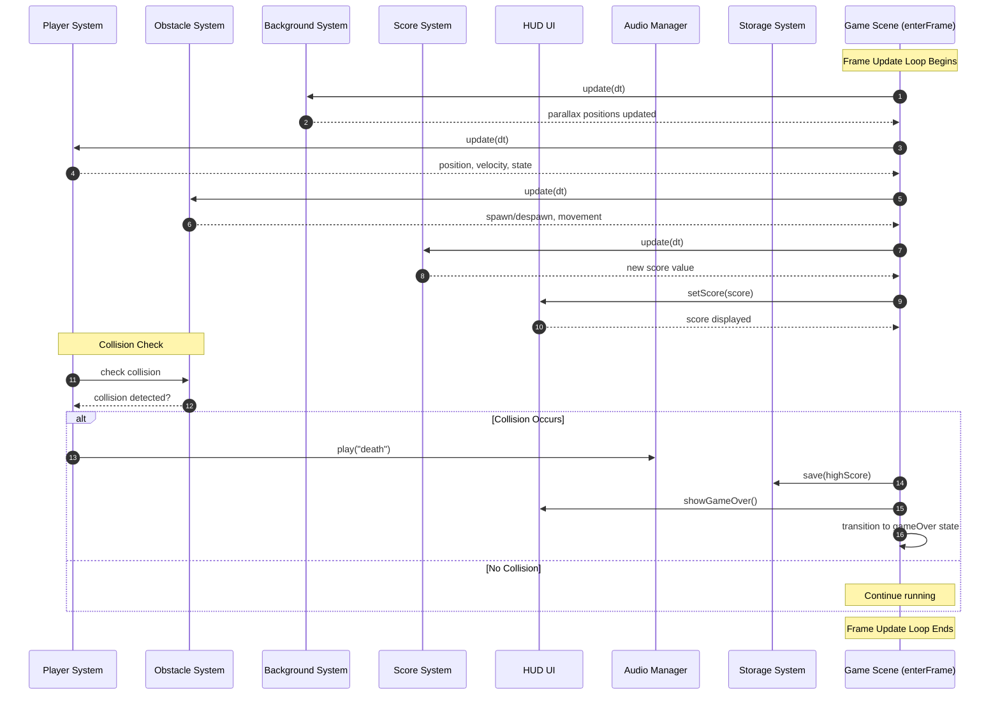

# 🧩 **Pixel Runner — Sequence Diagram**

---

---

# 🔍 **What This Diagram Shows**

### **1. The Game Scene orchestrates everything**
- `enterFrame` acts as the central update loop.
- Each system is updated in a predictable order.

### **2. Systems are modular and independent**
- Background scrolls.
- Player updates physics + state.
- Obstacles spawn/move/despawn.
- Score increments based on time.
- HUD reflects the score.

### **3. Collision detection is isolated**
- Player checks against obstacles.
- If collision → game over sequence triggers.

### **4. Game Over flow**
- Play death sound.
- Save high score.
- Show game over UI.
- Transition to gameOver state.

---
