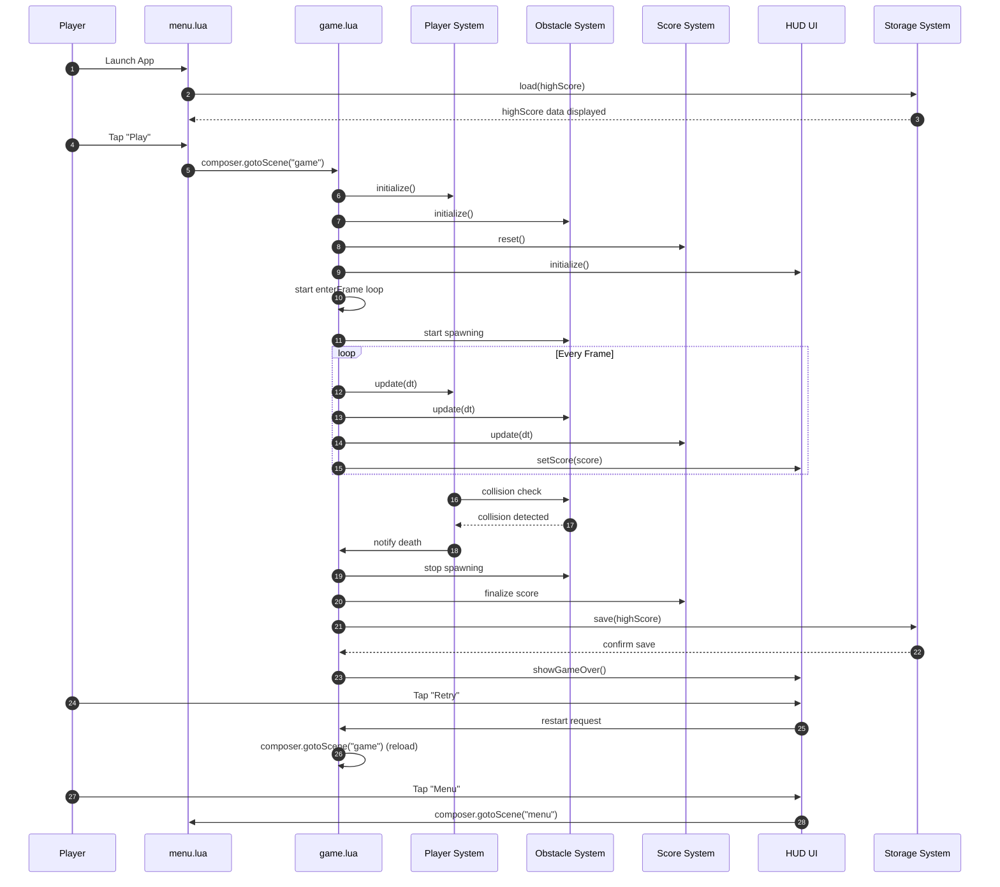

# 🧩 **Pixel Runner — Game Flow Sequence Diagram**

---

---

# 🔍 **What This Diagram Captures**

### **1. Full lifecycle of a run**
- App launch
- Menu load
- Game initialization
- Gameplay loop
- Collision → Game Over
- Restart or return to menu

### **2. Clear system responsibilities**
- `menu.lua` handles loading high score + navigation
- `game.lua` orchestrates systems
- Systems remain modular and independent

### **3. Persistence flow**
- High score loads on menu
- High score saves on game over

### **4. Clean restart logic**
- Restart simply reloads `game.lua`
- Ensures a clean state every run

---

