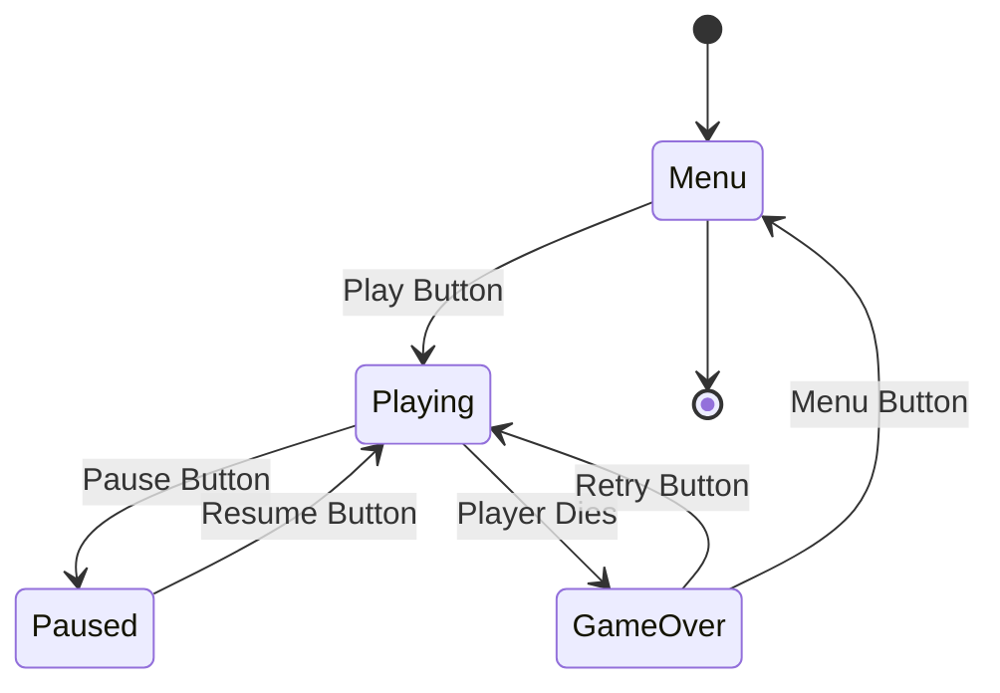

# 🧩 **Game State Machine Diagram**

---

---

# 🔍 **What This Diagram Captures**

### **Core Game States**
- **Menu** → initial state, shows title, high score, and Play button
- **Playing** → active gameplay, enterFrame loop running
- **Paused** → gameplay frozen, UI overlay active
- **GameOver** → triggered by collision, shows score + retry options

### **Transitions**
- **Menu → Playing** when the user taps *Play*
- **Playing → Paused** when the user taps *Pause*
- **Paused → Playing** when the user taps *Resume*
- **Playing → GameOver** when the player dies
- **GameOver → Playing** when the user taps *Retry*
- **GameOver → Menu** when the user taps *Menu*

### **Why This Matters**
This diagram clarifies:
- How scenes and overlays interact
- What triggers each transition
- How to keep state logic clean and predictable
- How to avoid inconsistent UI or stuck states

---
