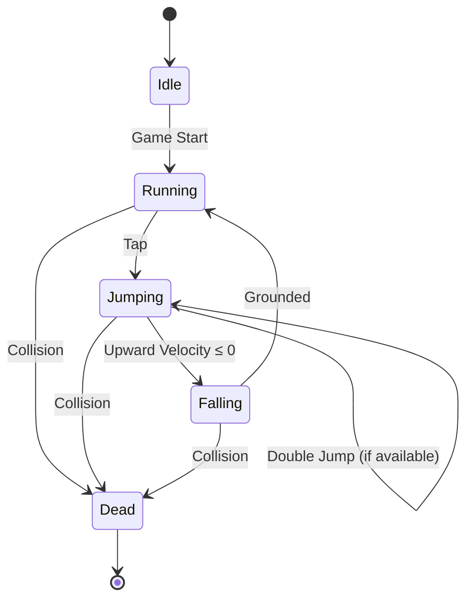

# 🧩 **Player State Machine Diagram**

---

---

## 📝 What This Diagram Captures

### **Core Movement States**
- **Idle** → before the run begins
- **Running** → default state during gameplay
- **Jumping** → triggered by tap
- **Falling** → natural transition when upward velocity ends
- **Dead** → triggered by collision

### **Optional Mechanics**
- **Double Jump** is represented as a self‑transition on `Jumping`
- Easy to toggle on/off in your implementation

### **Why This Matters**
This diagram helps you:
- Keep movement logic predictable
- Avoid edge‑case bugs (e.g., infinite jumps, stuck states)
- Communicate behavior clearly in your repo

---
