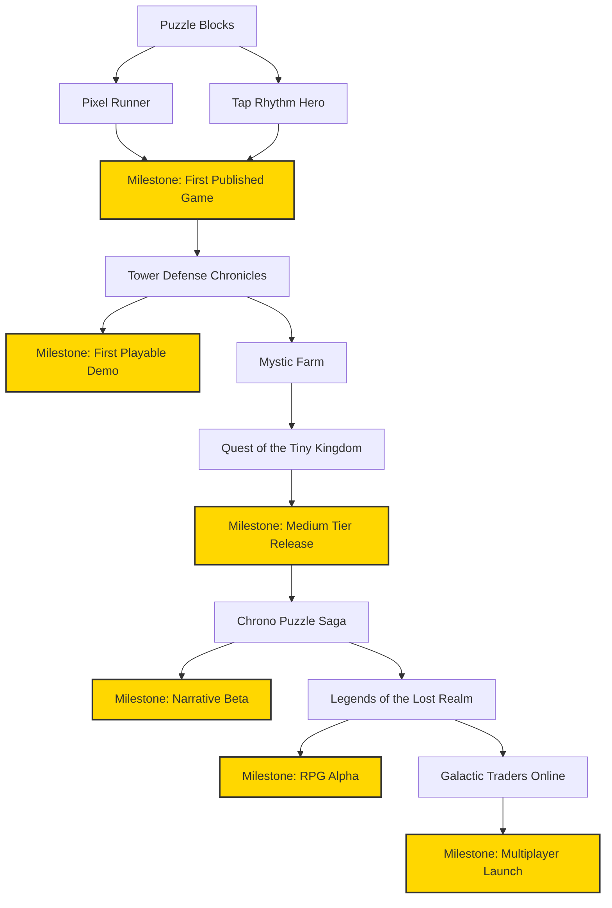

```mermaid
flowchart TD
    %% Phase 1: Low Effort
    A[Puzzle Blocks] --> B[Pixel Runner]
    A --> C[Tap Rhythm Hero]
    B --> M1[Milestone: First Published Game]
    C --> M1

    %% Phase 2: Medium Effort
    M1 --> D[Tower Defense Chronicles]
    D --> M2[Milestone: First Playable Demo]
    D --> E[Mystic Farm]
    E --> F[Quest of the Tiny Kingdom]
    F --> M3[Milestone: Medium Tier Release]

    %% Phase 3: High Effort
    M3 --> G[Chrono Puzzle Saga]
    G --> M4[Milestone: Narrative Beta]
    G --> H[Legends of the Lost Realm]
    H --> M5[Milestone: RPG Alpha]
    H --> I[Galactic Traders Online]
    I --> M6[Milestone: Multiplayer Launch]

    %% Styling
    classDef milestone fill:#ffd700,stroke:#333,stroke-width:2px;
    class M1,M2,M3,M4,M5,M6 milestone;
```
