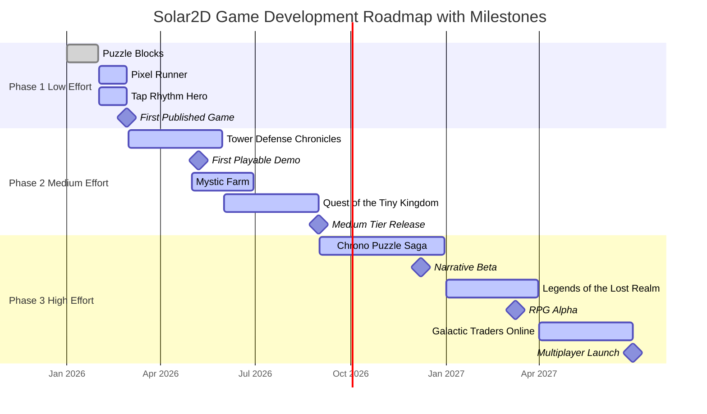

```mermaid
gantt
  title Solar2D Game Development Roadmap with Milestones
  dateFormat  YYYY-MM-DD
  axisFormat  %b %Y
  section Phase 1 Low Effort
  Puzzle Blocks          :done,    des1, 2026-01-01, 2026-01-31
  Pixel Runner           :active,  des2, 2026-02-01, 2026-02-28
  Tap Rhythm Hero        :active,  des3, 2026-02-01, 2026-02-28
  First Published Game :milestone, 2026-02-28

section Phase 2 Medium Effort
  Tower Defense Chronicles :active, des4, 2026-03-01, 2026-05-31
  First Playable Demo   :milestone, 2026-04-15
  Mystic Farm              :active, des5, 2026-05-01, 2026-06-30
  Quest of the Tiny Kingdom:active, des6, 2026-06-01, 2026-08-31
  Medium Tier Release   :milestone, 2026-08-31

section Phase 3 High Effort
  Chrono Puzzle Saga       :active, des7, 2026-09-01, 2026-12-31
  Narrative Beta        :milestone, 2026-11-15
  Legends of the Lost Realm :active, des8, 2027-01-01, 2027-03-31
  RPG Alpha             :milestone, 2027-02-15
  Galactic Traders Online   :active, des9, 2027-04-01, 2027-06-30
  Multiplayer Launch    :milestone, 2027-06-30
```
